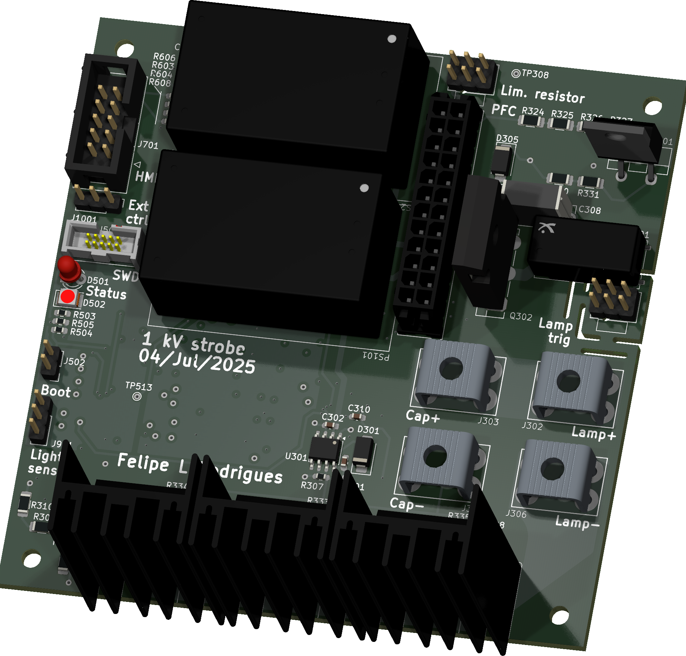
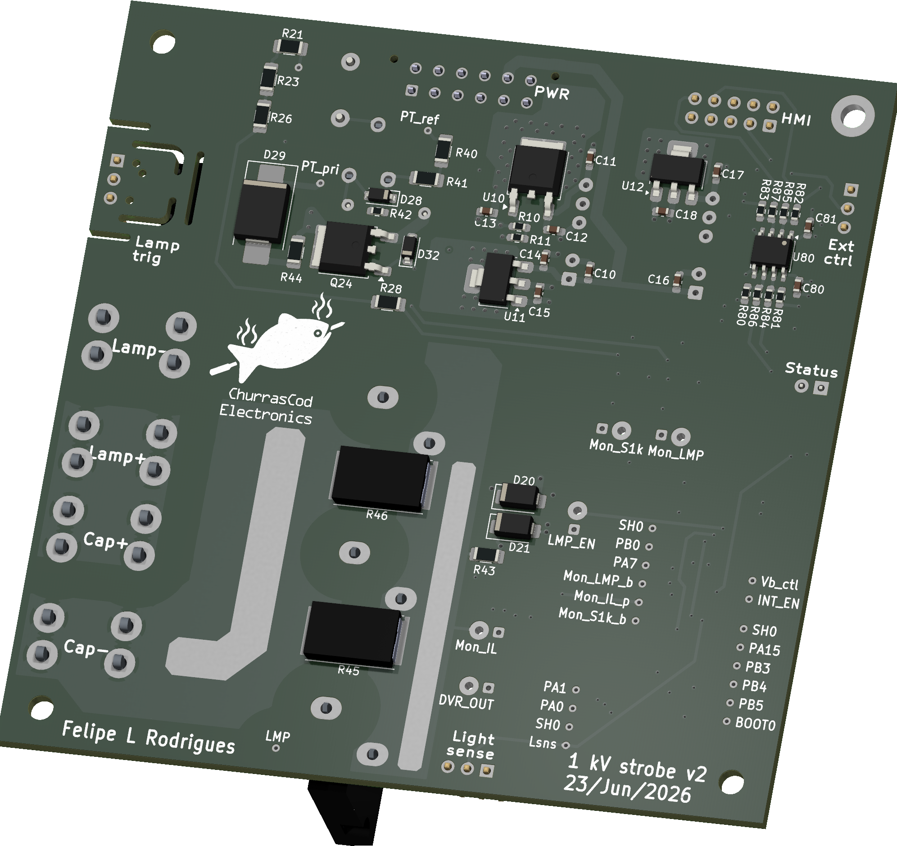

  

<h1 align="center">Main board</h1>

  

    

***

  
&nbsp; &nbsp; &nbsp; &nbsp;
  

***

# **1 kV strobe - Intro**
Since my tenage years I spend a great chunk of my spare time on hobby electronics. Back then, much of that time was to build FM transmitters, audio amplifiers and strobe lights. I was always pushing my builds as much as I could, (i.e., extracting pressurised smoke from capacitors!) as an attempt to make the flashes ever brighter. It was somewhat challenging given the limited experience and resources I had at the time, but a lot of fun nonetheless.
Life went on, priorities changed and for a long time I did not "play" with strobe lights... until recently, after I bumped into an ebay page with a large XOP-15 bulb and decided to build a new strobe.

While defining the project scope, I had to decide if I'd use the good old Xenon bulb or move to LEDs, as these have greatly evolved and are ubiquitous nowadays, making their way to commercial strobes (https://www.martin.com/en/products/atomic-3000-led). I have decided to stick to vintage tech, as in my mind this would perhpas bring a more interesting power electronics challenge: the bulb requires a somewhat high bus voltage and can draw very high peak currents when ionised.

So that's what I will document on this repo: a Xenon-based strobe light, aiming to drive a XOP-15 bulb with up to 1 kV, while controlling the duration and frequency of pulses.

## Project overview
This repository contains KiCad design files for the main board of a Xenon-based strobe light system.  
The system is divided into three separate boards:
- HMI - interface for the user to set desired operating conditions (bus voltage, pulse width and pulse frequency)  
- Main board - drives the Xenon bulb, generating the trigger pulse and actively interrupting the discharge according to the required pulse width  
- Power supply - to produce an adjustable DC supply derived from AC-mains, with PFC  
Working prototypes exist for both the HMI and main board and this repository covers only the main board; the HMI board should be available on GitHub in the near future; the power supply is yet to be developed.   
The interim solution used for the power supply is based on off-the-shelf boost converter modules: two such modules are connected in series, each providing up to 450 V output while supplied by a 12 V battery.
As a side project, these DCDC modules have been reverse engineered with the aim to modify them from non-isolated to isolated. This work is covered under the following repos:
- https://github.com/FLRHW/StepUp_module_12to450V
- https://github.com/FLRHW/Isolated_12to450V.

## Design targets
DC bus voltage: 400 V to 1000 V
Flash rate: 0.1 Hz to 100 Hz
Pulse duration: 20 μs to 200 ms

Not all extremes are simultaneously achievable.
Example: at 100 Hz, the period is 10 ms. This immediately limits the pulse duration to 10 ms; additionally, as the design relies on storing energy on a capacitor bank to later discharge it into the bulb, some time must be reserved to recharge the capacitor bank, so in practice the sustained pulse duration must be significantly shorter than the period at any given flash rate / frequency.  

## Intended use
This repository is intended for:
* Educational use and study of the circuit;
* Integration into hobby or research projects.  
Users are responsible for checking any patent, copyright, or regulatory constraints that may apply to their own use.

## License
The design files and documentation in this repository are released under the CERN Open Hardware Licence v2 – Permissive (CERN‑OHL‑P‑2.0). SPDX identifier: CERN-OHL-P-2.0 See the LICENSE file for the full legal text and conditions.  
In short and non‑legal terms, you are free to use, modify, manufacture, and distribute hardware based on these files, provided you respect attribution requirements and the terms in the license.

## Trademarks and third‑party rights
All product names, logos, and brands of the original module are the property of their respective owners and are not included or licensed here.  
Any reference to third‑party marks is purely descriptive and does not imply endorsement or affiliation.  

## Safety and disclaimer
* The design is provided as is, with no warranty of any kind;
* Use it at your own risk; always review the schematic, layout, and component ratings before using it;
* High voltage can cause injury, death, or damage to equipment; ensure appropriate protections and testing procedures.

***

## DIRECTORY STRUCTURE

    │
	├─ Code               # STM32 firmware
    ├─ Computations       # Misc calculations
    ├─ HTML               # HTML files for generated webpage
    ├─ Images             # Pictures and renders
    │
    ├─ kibot_resources    # External resources for KiBot
    │  ├─ colors          # Color theme for KiCad
    │  ├─ fonts           # Fonts used in the project
    │  ├─ scripts         # External scripts used with KiBot
    │  └─ templates       # Templates for KiBot generated reports
    │
    ├─ kibot_yaml         # KiBot YAML config files
    ├─ KiRI               # KiRI (PCB diff viewer) files
    │
    ├─ lib                # KiCad footprint and symbol libraries
    │  ├─ 3d_models       # Component 3D models
    │  ├─ lib_fp          # Footprint libraries
    │  └─ lib_sym         # Symbol libraries
    │
    ├─ Logos              # Logos
    │
    ├─ Manufacturing      # Assembly and fabrication documents
    │  ├─ Assembly        # Assembly documents (BoM, pos, notes)
    │  │
    │  └─ Fabrication     # Fabrication documents (ZIP, notes)
    │     ├─ Drill Tables # CSV drill tables
    │     └─ Gerbers      # Gerbers
    │
    ├─ Report             # Reports for ERC/DRC
    ├─ Schematic          # PDF of schematic
    ├─ Templates          # Title block templates
    └─ Testing
       └─ Testpoints      # Testpoints tables      

